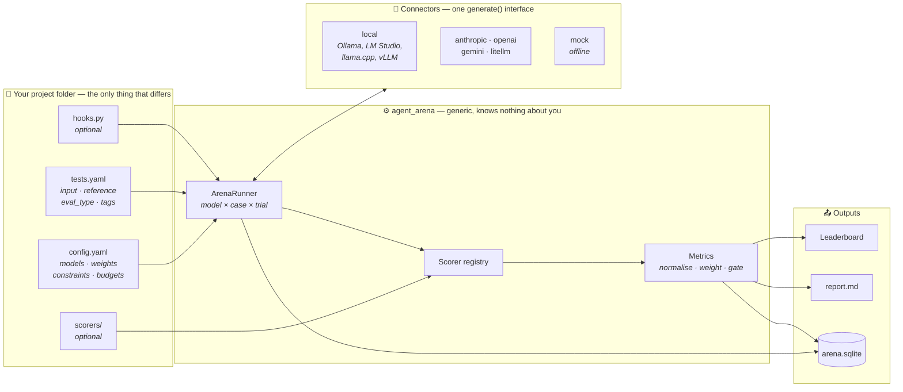
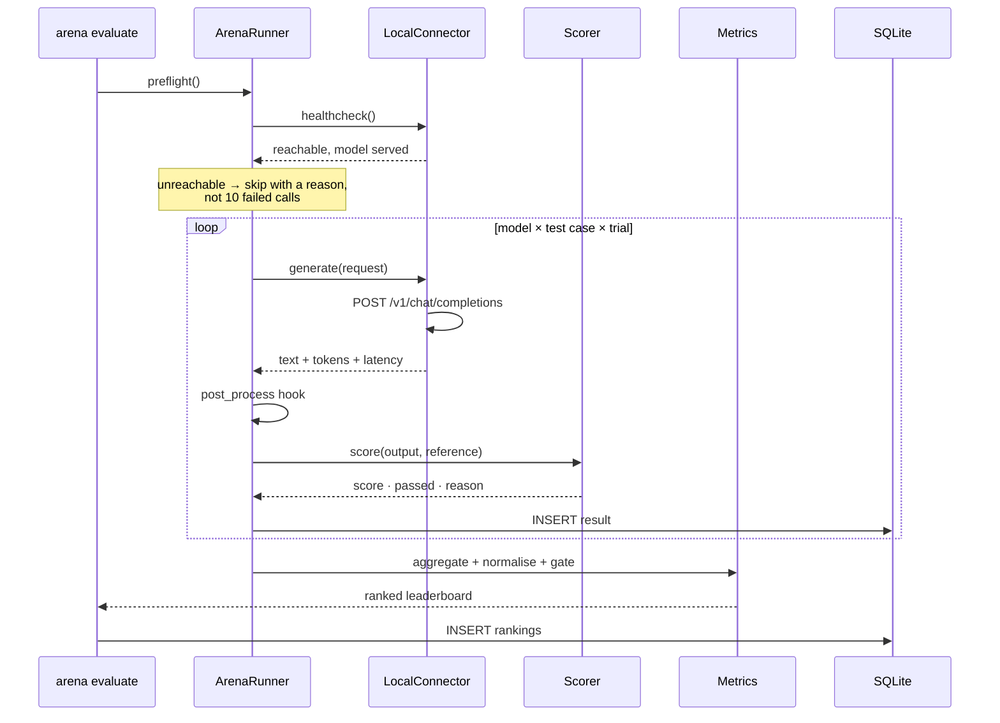
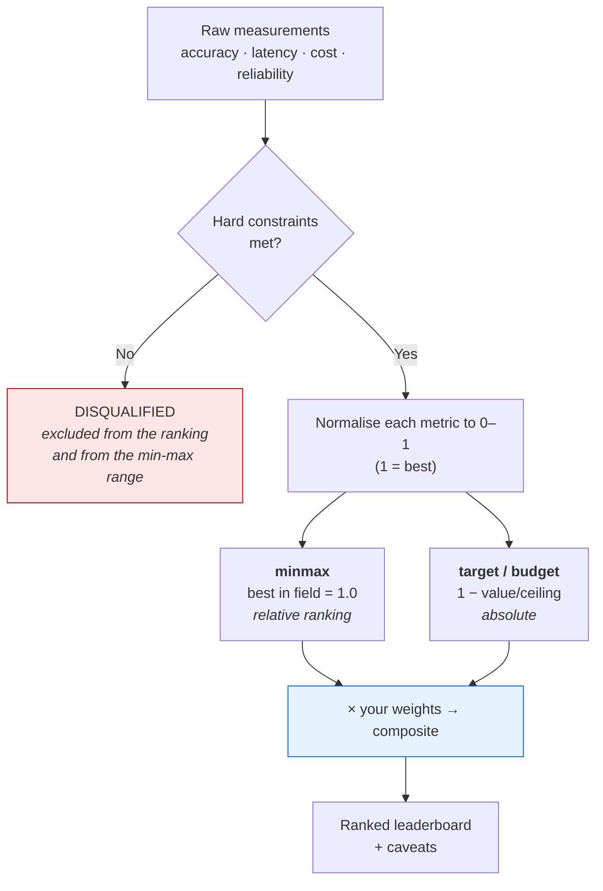
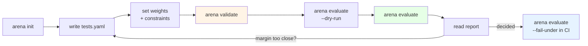

# Agent Arena — end-to-end demo

A complete walkthrough using models running **on your own machine**: no API key,
no per-token cost, no data leaving the box.

Every terminal block below is real captured output from the run described, not
an illustration.

> **About this transcript.** It was produced in a remote container with no
> Ollama installed, so it uses `demo/fake_local_server.py` — ~100 lines of
> stdlib HTTP that speaks the same `POST /v1/chat/completions` protocol Ollama
> exposes. The arena cannot tell the difference: same connector, same HTTP
> call, same code path. [Run it against real Ollama](#running-it-against-real-ollama)
> by changing two lines.

---

## Contents

- [What this demo shows](#what-this-demo-shows)
- [System design](#system-design)
- [The workflow](#the-workflow)
- [Step 0 — start a local model server](#step-0--start-a-local-model-server)
- [Step 1 — look at the project](#step-1--look-at-the-project)
- [Step 2 — validate before spending anything](#step-2--validate-before-spending-anything)
- [Step 3 — dry run](#step-3--dry-run)
- [Step 4 — run it](#step-4--run-it)
- [Step 5 — read the result](#step-5--read-the-result)
- [Step 6 — the report](#step-6--the-report)
- [Step 7 — query the database](#step-7--query-the-database)
- [Running it against real Ollama](#running-it-against-real-ollama)
- [Adapting this to your project](#adapting-this-to-your-project)

---

## What this demo shows

A support team wants to auto-route inbound tickets into six queues. Local
inference is free per call and keeps customer text on their own hardware, so
the real question is: **is a small local model good enough, or do we need a
big one — or a hosted one?**

Three local models compete, plus a hosted model for contrast. The demo ends
with a defensible answer *and* an honest caveat about how far to trust it.

---

## System design

The engine has no knowledge of any project. A project folder is the entire
contract; everything else is generic machinery.



### One call, end to end



### How a winner is chosen

The part worth understanding, because it is where the judgement lives:



Two rules that stop the number lying to you:

- A **disqualified** model is excluded from the min-max range, so an unusable
  outlier cannot distort how the real candidates compare.
- A metric that **cannot be measured** (no price for a model, say) has its
  weight redistributed rather than scored zero — a gap in our data should not
  look like a flaw in the model.

---

## The workflow



---

## Step 0 — start a local model server

```bash
python demo/fake_local_server.py --port 11434
```

```
stand-in local model server on http://127.0.0.1:11434/v1
serving: demo-large, demo-medium, demo-small
```

It speaks the standard protocol, so you can poke it directly:

```bash
curl -s http://localhost:11434/v1/chat/completions \
  -H 'Content-Type: application/json' \
  -d '{"model":"demo-large","messages":[{"role":"user","content":"I was charged twice"}]}'
```

```json
{"id": "chatcmpl-demo", "object": "chat.completion", "model": "demo-large",
 "choices": [{"index": 0, "message": {"role": "assistant", "content": "billing"},
 "finish_reason": "stop"}],
 "usage": {"prompt_tokens": 8, "completion_tokens": 1, "total_tokens": 9}}
```

The three "models" have deliberately different quality/speed profiles
(95%/900ms, 80%/320ms, 60%/90ms) and answer deterministically, so this demo
reproduces exactly on your machine.

---

## Step 1 — look at the project

Two files. That is the whole contract.

**`projects/local_demo/config.yaml`** — who competes, and what "best" means:

```yaml
models:
  - {key: local_large,  model: demo-large,  api_base: http://localhost:11434/v1}
  - {key: local_medium, model: demo-medium, api_base: http://localhost:11434/v1}
  - {key: local_small,  model: demo-small,  api_base: http://localhost:11434/v1}
  - {key: haiku, model: claude-haiku-4-5}    # hosted, for contrast

defaults:
  system: >
    You are a support ticket router. Reply with exactly one queue name from:
    billing, technical, account, shipping, refund, spam.
  max_tokens: 10
  temperature: 0

metrics:
  weights: {accuracy: 0.60, latency: 0.30, cost: 0.10}
  latency: {target_ms: 2000}
  cost:    {budget_usd_per_1k_calls: 1.0}

constraints:
  min_accuracy: 0.60          # below this, worse than a keyword rule

scorers:
  default: classification
  options:
    classification:
      labels: [billing, technical, account, shipping, refund, spam]
```

**`projects/local_demo/tests.yaml`** — ten tickets with known answers:

```yaml
- id: double_charge
  input: "I was charged twice for the same order this month. Please sort it out."
  reference: billing
  tags: [billing, easy]

- id: sso_loop
  input: "SSO sends me back to the login page forever after our IdP migration."
  reference: technical
  tags: [technical, hard]
  weight: 2                   # a hard case counts double
```

Check what will run:

```bash
arena tests --project projects/local_demo
```

```
local_demo: 10 test case(s) from 1 file(s)

  id              eval_type       tags              weight  input
  --------------  --------------  ----------------  ------  ----------------------------------------------------
  double_charge   classification  billing,easy      1       I was charged twice for the same order this month. …
  card_declined   classification  billing,hard      1       My card keeps getting declined at checkout but my b…
  app_crash       classification  technical,easy    1       The mobile app closes immediately every time I open…
  api_500         classification  technical,easy    1       Your /v2/export endpoint has been returning 500s fo…
  sso_loop        classification  technical,hard    2       SSO sends me back to the login page forever after o…
  password_reset  classification  account,easy      1       I can't reset my password, the email never arrives.
  seat_transfer   classification  account,hard      1       Our admin left the company. How do I take over the …
  parcel_late     classification  shipping,easy     1       Tracking says delivered but nothing arrived. Order …
  money_back      classification  refund,easy       1       This isn't what I expected at all. I'd like my mone…
  crypto_spam     classification  spam,easy         1       CONGRATULATIONS you have won 5 BTC, click here to c…
```

---

## Step 2 — validate before spending anything

```bash
arena validate --project projects/local_demo
```

```
✓ config      projects/local_demo/config.yaml
✓ test cases  10
✓ eval types  classification
✓ scorers     10 registered
✓ models      4 enabled
  ✓ local_large              demo-large                   priced
  ✓ local_medium             demo-medium                  priced
  ✓ local_small              demo-small                   priced
  ! haiku                    claude-haiku-4-5             ANTHROPIC_API_KEY is not set

These models would be skipped for missing credentials. Everything else is ready to run.
```

This catches config typos, unknown eval types, test cases missing a reference,
unreachable local servers, and un-pulled models — all before a single call.

---

## Step 3 — dry run

```bash
arena evaluate --project projects/local_demo --dry-run
```

```
Project : local_demo
Root    : projects/local_demo
Tests   : 10
Trials  : 2
Calls   : 60
Weights : accuracy 60%, latency 30%, cost 10%

  key           model             provider   est. cost  status
  ------------  ----------------  ---------  ---------  ----------------------------
  local_large   demo-large        local      $0.0000    ready
  local_medium  demo-medium       local      $0.0000    ready
  local_small   demo-small        local      $0.0000    ready
  haiku         claude-haiku-4-5  anthropic  $0.0000    ANTHROPIC_API_KEY is not set

  (dry run — nothing was called)
```

Local models cost `$0.0000` because that is true: marginal API cost on your own
hardware is zero. With hosted models this line is your bill before you incur it.

---

## Step 4 — run it

```bash
arena evaluate --project projects/local_demo
```

```
Running 60 call(s): 3 model(s) × 10 test(s) × 2 trial(s)
  skipping haiku: ANTHROPIC_API_KEY is not set
··················xx·x·x····xxxx······xx·········· 50/60
··xxxxx·x· 60/60
```

`·` is a pass, `x` a failed test case, `!` a call that errored.

---

## Step 5 — read the result

```
Agent Arena — local_demo
  4 models × 10 tests × 2 trial(s) = 60 calls in 6.6s

  #  model         id                composite  accuracy  latency  cost   status
  -  ------------  ----------------  ---------  --------  -------  -----  ------------
  1  local_small   demo-small        0.822      72.7%     94ms     $0.00  ranked
  2  local_large   demo-large        0.810      90.9%     904ms    $0.00  ranked
  -  local_medium  demo-medium       —          54.5%     324ms    $0.00  DISQUALIFIED
  -  haiku         claude-haiku-4-5  —          —         —        —      no data

  Winner: local_small  (accuracy 72.7%, latency 94ms, cost $0.00)
  ✗ local_medium: accuracy 54.5% below the required 60.0%
  · haiku: skipped — ANTHROPIC_API_KEY is not set
  ! local_small beat local_large by 0.012 — within noise for a small sweep.
    Repeated trials produced identical scores, so more trials will not separate
    them — add test cases instead.

  Run id: run_20260806_180025_07a96d   DB: projects/local_demo/results/arena.sqlite
```

Four things happened here, and each is the point of a different design decision:

**1. The most accurate model did not win.** `local_large` is 18 points more
accurate, but it is 10× slower, and this project weighted latency at 30%. That
is not the tool being wrong — it is the tool answering the question that was
actually asked. Change the weights and the winner changes.

**2. `local_medium` was disqualified, not ranked last.** At 54.5% it is below
the 60% floor. A weighted average would have let its speed partially rescue it;
"unusable" is not a quantity, so it is excluded outright — and excluded from the
min-max range, so it cannot distort how the other two compare.

**3. The hosted model was skipped, not failed.** No API key, so it produced no
data and the run still delivered a verdict on everything else.

**4. The arena argued against its own result.** A 0.012 margin is not a
finding. And note the *specific* advice: because repeated trials produced
identical scores, more trials would measure nothing — the sweep is
under-powered on **cases**, not on repeats. The honest read of this run is
"`local_small` and `local_large` are indistinguishable at n=10; go write more
test cases."

---

## Step 6 — the report

`results/<run_id>/report.md` is written on every run. It leads with the
trade-off, not just the number:

```markdown
## Recommendation

**`local_small`** — Local small (`demo-small`) — composite **0.822**.
accuracy 72.7%, latency 94ms, cost $0.00

It beats `local_large` by 0.012 on the composite, while losing on
accuracy (72.7% vs 90.9%).
```

It also contains a normalised-contribution table showing exactly where the
composite came from:

| model | accuracy ×0.60 | latency ×0.30 | cost ×0.10 | composite |
|---|---|---|---|---|
| `local_small` | 0.73 → 0.436 | 0.95 → 0.286 | 1.00 → 0.100 | **0.822** |
| `local_large` | 0.91 → 0.545 | 0.55 → 0.164 | 1.00 → 0.100 | **0.810** |

…a per-tag accuracy breakdown, a model × test-case matrix, and the actual wrong
answers with the reason each failed. No number in the report is unexplained.

---

## Step 7 — query the database

Every call is stored, so you are never limited to what the report chose to show:

```bash
arena history --project projects/local_demo
```

```
local_demo — recent runs

  started              run                         status     models  tests  calls  winner       spend
  -------------------  --------------------------  ---------  ------  -----  -----  -----------  -----
  2026-08-06T18:00:25  run_20260806_180025_07a96d  completed  3       10     60     local_small  —
```

```bash
arena history --project projects/local_demo --model local_small   # trend over runs
arena history --project projects/local_demo --flaky               # unstable cases
```

Or go straight to SQL:

```sql
SELECT model_key, COUNT(*) AS calls, ROUND(AVG(score),3) AS accuracy,
       ROUND(AVG(latency_ms)) AS mean_ms
FROM results WHERE status='ok' GROUP BY model_key ORDER BY accuracy DESC;
```

```
('local_large',  20, 0.9, 904.0)
('local_small',  20, 0.7,  94.0)
('local_medium', 20, 0.6, 324.0)
```

```sql
-- which cases are hardest across the whole field?
SELECT test_id, COUNT(*) AS models_failing FROM results
WHERE status='ok' AND passed=0 GROUP BY test_id ORDER BY models_failing DESC;
```

```
('money_back', 4)      ← every model got this one wrong
('sso_loop', 2)
('seat_transfer', 2)
('password_reset', 2)
```

That last query is how you find the gap in your prompt rather than in the
model: a case every model fails is usually an ambiguous instruction, not four
bad models.

---

## Running it against real Ollama

Nothing about the arena changes — same connector, same HTTP call. Stop the
stand-in server and:

```bash
ollama serve
ollama pull llama3.2
ollama pull qwen2.5:7b
```

Then edit `projects/local_demo/config.yaml` — replace the three `demo-*`
entries with:

```yaml
models:
  - {key: llama32, model: llama3.2}
  - {key: qwen25,  model: qwen2.5:7b}
  - {key: phi4,    model: phi4-mini}
```

No `provider:` line, no `api_base:` line, and **no Python SDK to install** —
the local connector is stdlib `urllib`, and `http://localhost:11434/v1` is the
default. Model names like `llama*`, `qwen*`, `mistral*`, `phi*`, `gemma*`,
`deepseek*` are routed locally automatically; anything else takes an explicit
`api_base` (which is also how you point at LM Studio on `:1234`, llama.cpp, or
vLLM).

```bash
arena validate --project projects/local_demo    # confirms the models are pulled
arena evaluate --project projects/local_demo
```

If Ollama is not running, or a model has not been pulled, you get told before
anything runs:

```
! llama32   llama3.2   model 'llama3.2' is not served by http://localhost:11434/v1
                       (available: qwen2.5:7b) — try `ollama pull llama3.2`
```

Two settings worth adjusting for real local models: raise `run.timeout_s` (the
first call after a model load can take a while) and keep `run.concurrency` low
(3–4) unless you have the VRAM for parallel requests.

### Mixing local and hosted in one run

This is the comparison most teams actually need — *is local good enough?*

```bash
export ANTHROPIC_API_KEY=sk-ant-...
arena evaluate --project projects/local_demo
```

Both go into the same leaderboard on the same test cases. The hosted model
carries a real per-call price; the local ones carry `$0.00` and satisfy
`on_prem` / `training_opt_out` / `zero_data_retention` privacy gates outright.
If your project declares those under `constraints.privacy.required`, hosted
models are disqualified unless you record what your contract actually covers:

```yaml
pricing:
  models:
    claude-haiku-4-5:
      privacy: {dpa: true, training_opt_out: true}
```

---

## Adapting this to your project

```bash
arena init projects/my_project
```

You edit two files; nothing in `agent_arena/` ever changes.

| Your project | `eval_type` | Weights that fit |
|---|---|---|
| Classification / routing | `classification` | accuracy 0.5, cost 0.3, latency 0.2 |
| Extraction to a schema | `json_match` | accuracy 0.7, reliability 0.1, cost 0.2 |
| Code generation | `code_exec` | accuracy 0.8, cost 0.2 |
| Summarization / RAG | `llm_judge` or `semantic` | accuracy 0.6, cost 0.4 |
| Math / numeric | `numeric` | accuracy 0.9, latency 0.1 |

Need grading logic none of those cover? Drop a file in `scorers/`:

```python
from agent_arena.scorers import Scorer, ScoreResult

class NoPiiScorer(Scorer):
    name = "no_pii"
    def score(self, output, reference, context):
        clean = not EMAIL_RE.search(output)
        return ScoreResult(score=1.0 if clean else 0.0, passed=clean,
                           metrics={"pii_leaks": 0.0 if clean else 1.0})
```

`eval_type: no_pii` in a test case, and `pii_leaks` becomes weightable in the
composite like any built-in metric.

Once it is running, wire it into CI as a regression gate:

```bash
arena evaluate --project projects/my_project --fail-under 0.80
```

Exits non-zero when the best composite drops below the threshold — which is how
you find out that a model update changed your numbers before your users do.

---

**Full reference:** [`docs/UNIVERSAL_ARENA.md`](docs/UNIVERSAL_ARENA.md) ·
**Design rationale:** [`docs/adr/0011-universal-config-driven-arena.md`](docs/adr/0011-universal-config-driven-arena.md)
